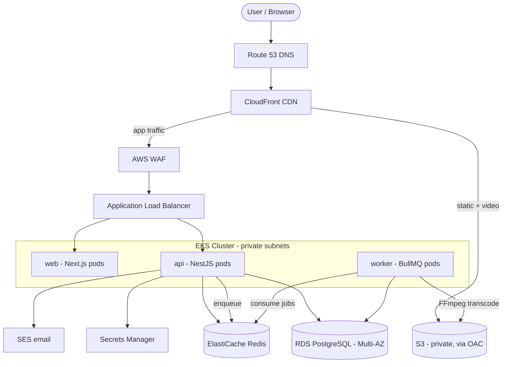
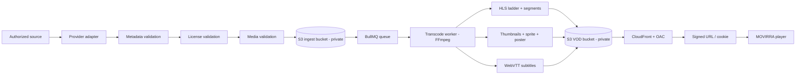
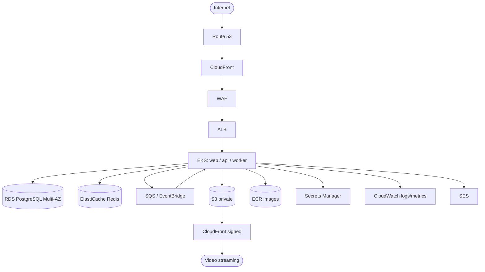
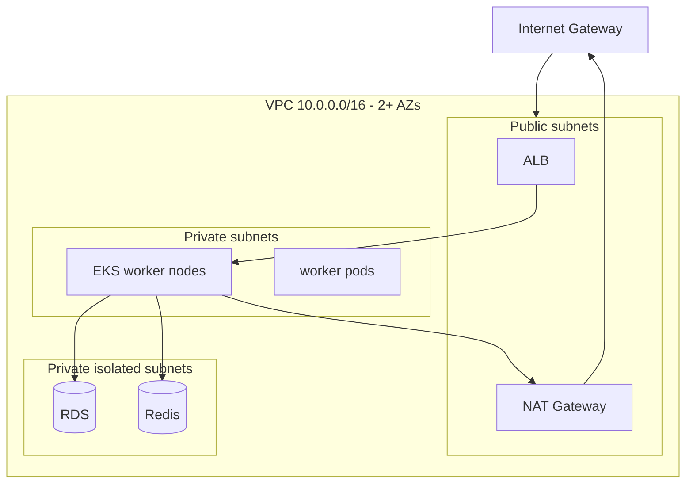
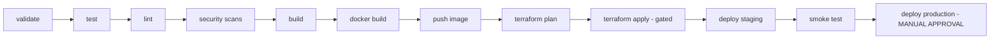
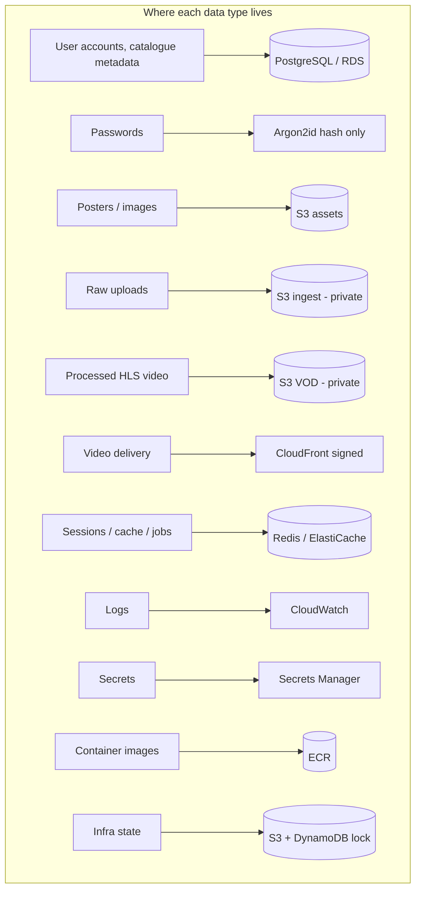
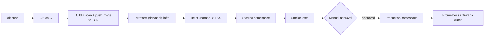

# MOVIRRA — Architecture & Project Blueprint

> **Author / Owner:** SufyanWithCode
> **Status:** STEP 1 — Architecture Blueprint (single source of truth)
> **Document type:** Living architecture document. Every later build phase must stay consistent with the decisions recorded here.

---

## 1. Final Project Name

**MOVIRRA** — kept as-is. It's short, brandable, pronounceable, has no trademark clash with existing streaming brands, and the `.com`/`.io`-style naming works for a portfolio. We use this name consistently everywhere: repo, containers, k8s namespace, Terraform workspace, S3 bucket prefixes, and UI.

---

## 2. Project Vision

MOVIRRA is an **original, legally-sourced** movie streaming platform built to production standards. It is deliberately *not* a tutorial toy — it is a portfolio artefact that proves end-to-end capability across full-stack development, cloud architecture, DevOps, and SRE.

Three non-negotiable principles drive every decision:

1. **Legal media only.** Public-domain, Creative Commons, properly licensed, or admin-uploaded content. No scraping, no DRM/CAPTCHA/hotlink bypass, no redistribution of protected files. A `MovieProvider` abstraction makes the legal source pluggable.
2. **Original brand & UI.** No copying of any existing streaming service's logo, layout, animations, or assets. A distinct 3D "digital cinema" identity.
3. **Real production posture.** Infrastructure as Code, CI/CD with security gates, secrets management, observability, backups, and disaster recovery — all wired, not faked.

---

## 3. Complete Feature List

**Public / marketing**
- Landing page, original 3D cinematic homepage, 404/500 pages.

**Auth & account**
- Register, login, logout, email verification, forgot/reset password, change password, refresh-token rotation, session/device tracking, multiple profiles per account.

**Discovery & catalogue**
- Home hero + rails (Trending, Popular, Recently Added, Top Rated, Continue Watching, Recommended, per-genre rails), search (title/actor/director/genre/year), genre & category pages, movie detail pages, similar-movies.

**Playback**
- HLS adaptive-bitrate player: play/pause/seek/volume/fullscreen, playback speed, quality selector, subtitle selector, audio-track selector, picture-in-picture, keyboard shortcuts, resume/continue-watching, progress tracking.

**Personalisation & social**
- Watchlist, watch history, ratings, reviews, recommendations, notifications, user settings.

**Admin**
- Dashboard (users/views/watch-time/storage/bandwidth), movie CRUD, media upload + transcode monitoring, license management, cast/director/genre management, user management (suspend/ban/restore/role change/session view), review & rating moderation, audit log viewer, platform settings.

**Platform-ready (interfaces only, no fake processing)**
- Subscription plans (Free/Premium), billing/payment provider interface, analytics, audit logging.

---

## 4. Complete Technology Stack

| Layer | Technology | Why |
|---|---|---|
| **Frontend** | Next.js (App Router), React, TypeScript | SSR/ISR for SEO on movie pages + fast SPA feel |
| Styling | Tailwind CSS | Fast, consistent, small CSS footprint |
| 3D | Three.js + React Three Fiber + drei | Declarative 3D inside React; GLTF/GLB assets |
| Motion | Framer Motion | Cinematic UI transitions |
| State | Zustand (client) + TanStack Query (server-state) | Zustand for UI state, TanStack Query for caching/fetch |
| Forms | React Hook Form + Zod | Performant forms + shared validation schema |
| **Backend** | NestJS (Node.js + TypeScript) | Modular, DI, enterprise structure, first-class testing |
| ORM | Prisma | Type-safe queries + migrations |
| **Database** | PostgreSQL | Relational integrity for catalogue + accounts |
| Cache/queue backend | Redis | Sessions, cache, BullMQ broker |
| Jobs | BullMQ | Async transcoding/email/indexing/analytics |
| Media | FFmpeg | Transcode to HLS ladder + thumbnails/subtitles |
| Player | hls.js | HLS ABR in browsers without native HLS |
| **Containers** | Docker (multi-stage) | Reproducible builds |
| Orchestration | Kubernetes (EKS) + Helm | Portfolio centrepiece; realistic scaling |
| IaC | Terraform | Declarative AWS provisioning |
| Edge/proxy | Nginx | Reverse proxy, TLS termination, headers, rate-limits |
| **CI/CD** | GitLab CI (pipeline) + GitHub (public showcase mirror) | GitLab for gated pipeline, GitHub for portfolio visibility |
| Observability | Prometheus + Grafana + OpenTelemetry | Metrics, dashboards, traces |
| Search (future) | OpenSearch/Elasticsearch adapter | Postgres full-text now; swap later |

> **Architectural judgement note:** the prompt lists *both* ECS/Fargate and EKS, and *both* GitHub and GitLab. Good architecture does **not** use everything for its own sake. Decisions: **EKS** as primary compute (you're learning Kubernetes, and it's the strongest portfolio signal), with **Fargate noted as the cheaper managed alternative**; **GitLab CI** as the pipeline engine with **GitHub as the public mirror/showcase**. These choices are revisited under §12 and §29.

---

## 5. Complete Folder Structure (monorepo)

```text
movirra/
├── apps/
│   ├── web/          # Next.js frontend (public site + user app)
│   ├── admin/        # Admin dashboard (can be a route-group in web or separate app)
│   ├── api/          # NestJS backend (REST + WS)
│   └── worker/       # BullMQ consumers: transcode, email, indexing, analytics
├── packages/
│   ├── ui/           # Shared React component library + design tokens
│   ├── database/     # Prisma schema, migrations, seed, generated client
│   ├── types/        # Shared TypeScript types / DTO contracts
│   ├── config/       # Shared runtime config + env validation (Zod)
│   └── eslint-config/
├── infrastructure/
│   ├── terraform/    # modules/ + environments/{dev,staging,production}
│   ├── kubernetes/   # raw manifests (reference)
│   └── helm/movirra/ # Helm chart + per-env values
├── docker/           # frontend/backend/worker/nginx Dockerfiles
├── nginx/            # nginx.conf + site configs
├── scripts/          # bootstrap, migrate, seed, backup, restore helpers
├── docs/
│   ├── architecture/ aws/ database/ deployment/
│   ├── security/ operations/ commands/ troubleshooting/
├── tests/            # e2e (Playwright), load (k6)
├── .github/          # workflows (mirror/lint), issue templates
├── .gitlab/          # pipeline includes/templates
├── .env.example
├── docker-compose.yml
├── .gitlab-ci.yml
├── README.md  ARCHITECTURE.md  SECURITY.md  CONTRIBUTING.md  CHANGELOG.md  LICENSE
```

**Why a monorepo:** shared types/DTOs between frontend and backend stay in sync, one CI pipeline, atomic cross-cutting changes. Tooling: pnpm workspaces + Turborepo (task caching).

---

## 6. System Architecture (high level)



Everything stateful (RDS, Redis, EKS worker nodes) lives in **private subnets**. Only the ALB and NAT Gateway sit in public subnets.

---

## 7. Frontend Architecture

- **App Router** with route groups: `(marketing)` for landing, `(auth)` for login/register/reset, `(app)` for the signed-in experience, `(admin)` for the dashboard.
- **Rendering strategy:** movie detail & genre pages use **ISR** (SEO + freshness); the signed-in app shell is client-rendered; the 3D hero is a client component loaded via `next/dynamic` with a static poster fallback.
- **Data:** TanStack Query wraps a typed API client generated from the shared `packages/types` DTOs. Auth uses HTTP-only cookies; the client never touches raw tokens.
- **3D:** isolated under `features/cinema/`. Guarded by a capability check — low-end devices and `prefers-reduced-motion` get a static cinematic image instead of the WebGL scene.

```text
apps/web/
├── app/(marketing) (auth) (app) (admin)
├── components/    # dumb, reusable UI (from packages/ui)
├── features/      # cinema/, player/, catalog/, watchlist/ (feature-scoped logic)
├── hooks/  lib/  services/  store/  types/  public/  styles/
```

---

## 8. Backend Architecture (NestJS)

Feature modules map 1:1 to the domain: `auth, users, profiles, movies, genres, actors, directors, media, streaming, subtitles, watchlist, history, ratings, reviews, recommendations, search, notifications, subscriptions, payments, admin, analytics, audit, health`.

Cross-cutting concerns as Nest primitives:
- **Guards:** JWT auth guard + RBAC roles guard.
- **Interceptors:** structured logging, response shaping, request-id propagation.
- **Pipes:** Zod/class-validator DTO validation on every input.
- **Filters:** global exception filter → consistent error envelope.
- **Middleware:** rate limiting, Helmet security headers, CORS.

API is **versioned** (`/api/v1/...`). WebSockets used only where they earn their keep: real-time notifications and admin transcode-progress. Everything else is REST.

---

## 9. Database Architecture

**Engine:** PostgreSQL on **RDS (Multi-AZ)**. ORM: **Prisma**.

Domain groups (tables):

- **Identity & access:** `users, roles, permissions, user_roles, profiles, sessions, refresh_tokens`
- **Catalogue:** `movies, genres, movie_genres, actors, directors, movie_cast, trailers, media_assets, video_files, subtitles, languages`
- **User activity:** `watch_history, watchlists, ratings, reviews, recommendations`
- **Commerce (interfaces):** `subscriptions, payments`
- **Platform:** `notifications, audit_logs`

Standards enforced everywhere: foreign keys, indexes on all lookup/sort columns, check constraints, transactions for multi-table writes, Prisma migrations (never manual schema edits), and idempotent seed data. Full ER diagram + migration/backup/restore guides land in `docs/database/` in the DB phase.

---

## 10. Media Architecture (legal ingestion)

Content source is an **interface**, so the legal origin is swappable:

```text
MovieProvider (interface)
├── PublicDomainProvider
├── CreativeCommonsProvider
├── LicensedProvider
└── AdminUploadProvider
```

Every provider must declare: name, source, license, permission status, metadata source, media source, attribution requirements. **Rule enforced in code:** content is never treated as free just because it's reachable online — a movie cannot be published without a validated `license` record.

Ingestion pipeline (each stage is a discrete, retryable job):



> **Managed alternative noted:** AWS Elemental **MediaConvert** can replace the FFmpeg worker for higher scale. We build FFmpeg-on-worker first (cheaper, more educational, full control) behind the same job interface, so switching later is a config change, not a rewrite.

---

## 11. Video Streaming Architecture

- **Format:** HLS with an ABR ladder — `360p / 480p / 720p / 1080p` (plus `1440p/2160p` only when the source justifies it). Output layout: `master.m3u8` + per-rendition playlists + `.ts`/`fMP4` segments.
- **Delivery:** private S3 VOD bucket fronted by **CloudFront** using **Origin Access Control** (bucket is never public).
- **Security:** **signed CloudFront URLs/cookies** minted by the API only after an entitlement check (auth + license/plan). Short TTLs.
- **Client:** hls.js does ABR switching; player reports progress to the API for continue-watching. Subtitles are sidecar WebVTT selected client-side.

---

## 12. AWS Architecture (services + why)

*(Full "why each service" table is §27; this is the shape.)*



Compute decision: **EKS primary**, Fargate/ECS documented as the low-ops alternative. Storage split into distinct buckets: `assets` (posters/images), `ingest` (raw uploads), `vod` (processed HLS), `tfstate` (Terraform), `logs`/`backups`.

---

## 13. VPC / Network Architecture



- **CIDR:** `10.0.0.0/16`, split into public (`/20`), private-app (`/20`), private-data (`/24`) subnets, replicated across **≥2 AZs** for HA.
- **Route tables:** public → IGW; private-app → NAT; private-data → no internet route (fully isolated).
- **Security groups (least privilege):** ALB SG allows 80/443 from internet; node SG allows traffic only from ALB SG; RDS SG allows 5432 only from node SG; Redis SG allows 6379 only from node SG. No 0.0.0.0/0 anywhere except the ALB.
- **NAT** lets private nodes pull images/updates outbound without being reachable inbound.

---

## 14. Security Architecture (defence in depth)

| Layer | Controls |
|---|---|
| Edge | CloudFront + **WAF** (OWASP managed rules, rate-based rules), TLS via ACM |
| Network | Private subnets, tight SGs, isolated data tier, no public DB |
| App | JWT + refresh rotation, **RBAC**, Zod validation, CSRF on cookie flows, Helmet headers, per-route rate limits, file-upload validation, SSRF-safe outbound |
| Data | RDS encryption (KMS), S3 SSE + private buckets + OAC, secrets in **Secrets Manager**, signed media URLs |
| Identity | IAM least privilege, **IRSA** (pod-level IAM), OIDC for CI → no long-lived keys |
| Audit | CloudTrail, GuardDuty, app-level `audit_logs` |
| Passwords | **Argon2id** hashes only, strength validation, no plaintext ever |

Full details + threat notes go in `SECURITY.md`.

---

## 15. Docker Architecture

Four images, all **multi-stage**, **non-root**, minimal base (`node:alpine`/`distroless`), with `HEALTHCHECK`s and no secrets baked in:
`frontend.Dockerfile`, `backend.Dockerfile`, `worker.Dockerfile`, `nginx.Dockerfile`.

`docker-compose.yml` for local dev brings up: `frontend, backend, postgres, redis, worker, nginx` — a full stack on your laptop with one command. FFmpeg is installed in the worker image.

---

## 16. Kubernetes Architecture

Per service: Deployment + Service + resource **requests/limits** + **readiness/liveness** probes. Cluster-level: dedicated `movirra` Namespace, ConfigMap (non-secret config), Secrets (from Secrets Manager via External Secrets Operator), Ingress (ALB controller), **HPA** (CPU/memory autoscaling), **PodDisruptionBudget** (safe rollouts/node drains).

```text
k8s/
├── namespace.yaml  configmap.yaml  secrets.example.yaml
├── frontend/  backend/  worker/
├── ingress/  autoscaling/  monitoring/
```

---

## 17. Terraform Architecture

Reusable **modules** composed per **environment** — dev/staging/production are the *same* modules with different variables, so environments can't drift.

```text
infrastructure/terraform/
├── environments/{dev,staging,production}/
└── modules/{vpc,eks,rds,s3,cloudfront,route53,iam,redis,monitoring,security}/
```

**Remote state** in a dedicated S3 bucket with **DynamoDB state locking**. Every module exposes typed variables + outputs; no hardcoded account IDs or secrets. All commands (`init/fmt/validate/plan/apply/destroy/output/state list`) explained in `docs/commands/`.

---

## 18. GitHub Strategy

GitHub is the **public showcase**. It holds the polished `README.md` (with screenshots, architecture, setup, deployment), issue/PR templates, a mirror workflow, and the LICENSE. Protected `main`, PRs required, semantic versioning + tags. Owner attribution: **SufyanWithCode**. Your repo URL stays a placeholder — never invented for you.

---

## 19. GitLab Strategy

GitLab runs the **gated CI/CD pipeline**. Uses protected branches, protected CI/CD variables (secrets live here, not in code), environments (staging/production) with **manual approval** on production, GitLab Runners, and either GitLab Container Registry or ECR for images.

---

## 20. CI/CD Architecture



Security stage bundles: SAST, dependency scan, secret scan, container scan, Terraform (IaC) scan. Production deploy is **manual-approval only** and restricted to protected environments.

---

## 21. Monitoring & Observability Architecture

- **Metrics:** Prometheus scrapes app/infra/k8s metrics.
- **Dashboards:** Grafana — separate boards for Application, Infrastructure, Database, Redis, Kubernetes, Streaming, AWS, CI/CD, Security.
- **Logs:** structured JSON → CloudWatch (and/or Loki).
- **Tracing:** OpenTelemetry across API → worker → DB.
- **Alerts:** on API latency, error rate, CPU/mem, DB connections, queue depth, streaming errors, transcode failures.

---

## 22. Backup Architecture

- **RDS:** automated backups + **point-in-time recovery**, retention 7–35 days.
- **S3:** versioning on `vod`/`assets`, lifecycle rules (transition to cheaper tiers, expire old ingest artefacts).
- **Config/state:** Terraform state versioned in S3; k8s manifests are the source of truth in git.
- **Cross-region** copies for production-critical buckets where justified.

---

## 23. Disaster Recovery Architecture

Documented targets in `docs/operations/`:

| Metric | Target (initial) |
|---|---|
| **RPO** (max data loss) | ≤ 15 min (PITR + frequent snapshots) |
| **RTO** (max downtime) | ≤ 1–2 hrs |
| Backup frequency | RDS continuous (PITR) + daily snapshot; S3 versioned |
| Retention | 30 days snapshots; per-bucket lifecycle |
| Recovery drill | Restore-to-new-env runbook, tested (not assumed) |

DR strategy: Multi-AZ handles zone failure automatically; a documented **restore-from-snapshot into a fresh Terraform stack** handles region/account-level disasters.

---

## 24. Data-Flow Diagram



Passwords are **never** stored in any form except an Argon2id hash. Video files are **never** public — always private S3 reached only through signed CloudFront.

---

## 25. Deployment-Flow Diagram



---

## 26. Development Roadmap (27 phases)

| # | Phase | # | Phase |
|---|---|---|---|
| 1 | Architecture *(this doc)* | 15 | Testing |
| 2 | Repository setup | 16 | Docker |
| 3 | Frontend foundation | 17 | Nginx |
| 4 | 3D experience | 18 | GitHub |
| 5 | Backend foundation | 19 | GitLab CI/CD |
| 6 | Database | 20 | AWS |
| 7 | Authentication | 21 | Terraform |
| 8 | Movie catalogue | 22 | Kubernetes |
| 9 | Media ingestion | 23 | Monitoring |
| 10 | Video processing | 24 | Security hardening |
| 11 | HLS streaming | 25 | Backups |
| 12 | Admin dashboard | 26 | Production deployment |
| 13 | Search | 27 | Disaster recovery |
| 14 | Recommendations | | |

Each phase ships working code **and** a teaching write-up (what / why / how / where it fits / install / config / commands / test / deploy / secure / scale / troubleshoot / production notes).

---

## 27. AWS Services — and WHY each is used

| Service | Purpose | Why this one |
|---|---|---|
| **VPC + subnets + IGW + NAT + route tables** | Network isolation | Foundation of a secure, private architecture |
| **Security Groups + NACLs** | Traffic control | Least-privilege at instance + subnet level |
| **EKS** | Run web/api/worker | Kubernetes = the portfolio centrepiece + realistic scaling |
| *(Fargate/ECS)* | Alt compute | Documented low-ops/cheaper option |
| **ALB** | L7 load balancing | Path routing, TLS, health checks, WS support |
| **S3** | Object storage | Images, raw uploads, HLS output, tfstate, backups |
| **RDS PostgreSQL (Multi-AZ)** | Primary DB | Managed HA relational store; read replicas when needed |
| **ElastiCache Redis** | Cache + queue backend | Sessions, cache, BullMQ broker |
| **CloudFront** | CDN | Global low-latency delivery; **signed URLs** for secure video |
| **Route 53** | DNS | Domain + health-checked routing |
| **ACM** | TLS certs | Free managed certs for HTTPS |
| **IAM + KMS** | Identity + encryption | Least privilege, encryption at rest |
| **Secrets Manager** | Secret storage | No secrets in code or images |
| **WAF** | Web firewall | OWASP + rate-based protection at the edge |
| **CloudTrail + GuardDuty** | Audit + threat detection | Governance & security monitoring |
| **ECR** | Container registry | Private, scanned images near EKS |
| **SQS / SNS / EventBridge** | Messaging | Decouple ingestion/transcode/notifications |
| **CloudWatch** | Logs/metrics/alarms | Central observability + alerting |
| **SES** | Email | Verification + reset emails |

Services are chosen for a *purpose*, not for a checklist. Anything unused is left out.

---

## 28. Production Scaling Strategy

- **Stateless pods (web/api/worker):** horizontal scaling via **HPA** on CPU/memory/queue-depth; cluster autoscaler adds nodes.
- **Database:** vertical scaling first, then **read replicas** for read-heavy catalogue/browse traffic; connection pooling (PgBouncer).
- **Cache:** Redis for hot metadata + session offload; caches heavy recommendation/rail queries.
- **Media:** transcoding scales out by adding worker pods (or switching to MediaConvert); delivery scales automatically via CloudFront edge.
- **Search:** Postgres FTS now → OpenSearch when catalogue/query volume grows (adapter already in place).
- **Async everything heavy:** transcoding, emails, indexing, analytics never block API requests.

---

## 29. Cost-Awareness Considerations

**Honest warning:** the *full* production footprint (EKS + Multi-AZ RDS + 2× NAT Gateways + ElastiCache running 24/7) realistically costs **~$300–600+/month**. For a learning/portfolio project that's often wasteful. Recommended patterns:

1. **Local first:** most phases (frontend, backend, DB, auth, catalogue, player, Docker) run fully on `docker compose` — **$0**.
2. **Kubernetes learning locally:** use **kind/minikube** for the k8s phases before touching EKS — **$0**.
3. **On-demand demos:** `terraform apply` to spin the real AWS stack for a demo/screenshots, then `terraform destroy`. Pay for hours, not months.
4. **Demo tier:** single-AZ RDS, one small node group, single NAT — a fraction of full-prod cost when you do keep it running.
5. **Guardrails:** AWS Budgets + billing alarms wired from day one; S3 lifecycle to expire raw ingest artefacts.

This is the difference between a portfolio that teaches you cloud and one that quietly drains your card.

---

## 30. Security Considerations (summary)

- **OWASP Top 10** addressed: parameterised queries (SQLi), output encoding + CSP (XSS), CSRF tokens on cookie flows, SSRF-safe outbound calls, strict access control (RBAC on every route).
- **No secrets in git** — enforced by secret scanning in CI + `.env.example` only.
- **Argon2id** password hashing, refresh-token rotation, session/device tracking.
- **Private buckets + signed CloudFront** — video is never directly reachable.
- **IAM least privilege + IRSA + OIDC** — no long-lived AWS keys, pod-scoped permissions.
- **Encryption everywhere** — KMS for RDS/S3, TLS in transit.
- **Audit + detection** — CloudTrail, GuardDuty, app `audit_logs`, alerting on anomalies.
- **Legal safety** — no copyrighted content, no DRM/CAPTCHA/hotlink bypass; license validation is enforced in code before any movie can go live.

---

## Appendix — Key Decisions Log (for consistency across phases)

1. **Compute:** EKS primary; Fargate documented alternative.
2. **CI/CD:** GitLab pipeline + GitHub public mirror.
3. **Transcoding:** FFmpeg-on-worker behind a job interface; MediaConvert swappable later.
4. **Search:** Postgres FTS now; OpenSearch adapter for later.
5. **Buckets:** separate `assets` / `ingest` / `vod` / `tfstate` / `logs`+`backups`.
6. **Auth tokens:** HTTP-only cookies to the browser; API mints signed media URLs after entitlement check.
7. **Media legality:** `MovieProvider` interface + enforced `license` record — no license, no publish.
8. **Cost:** local `docker compose` + kind/minikube by default; AWS on-demand for demos.

*Any future change to these decisions gets recorded here so no phase silently contradicts another.*
